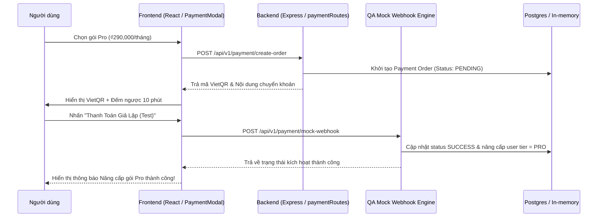

# Báo cáo Cơ cấu Nhân sự AI Virtual Agency (Org Structure Report)

**Dự án**: Lunar Code Review (Hệ thống Thanh toán Chuẩn VietQR & Thẻ quốc tế)  
**Chi nhánh Git**: `Acer`  
**Ngày cập nhật**: 29/07/2026  

---

## 🏛 BẢNG PHÂN BỔ NHÂN SỰ VÀ TRÁCH NHIỆM AI AGENTS

| Vai trò Agent | Skill Đảm nhận | Trách nhiệm chính trong Hệ thống Thanh toán |
|---|---|---|
| **Master Orchestrator** | `master-orchestrator` | Khởi tạo tài liệu `docs/`, lập Báo cáo Cơ cấu Nhân sự & Báo cáo Nghiệm thu Walkthrough. |
| **Security Architect** | `security-architect` | Đảm bảo an toàn OWASP ASVS Level 2, cấu hình JWT Bearer, Rate Limiting & Prepared Statements cho API thanh toán (`server/routes/paymentRoutes.js`). |
| **QA Circuit Breaker** | `qa-circuit-breaker` | Dựng Mock Webhook Engine cho giao dịch thanh toán VietQR & Thẻ quốc tế, tự động kiểm thử trạng thái đơn hàng mà không phụ thuộc cổng thật. |
| **Anti-AI UI Developer** | `anti-ai-ui-developer` | Thiết kế UI/UX Luma Editorial Minimal, sử dụng VietQR làm phương thức mặc định, định dạng giá chuẩn Việt Nam (`₫290,000`), tuyệt đối không emoji. |

---

## 🔄 LUỒNG PHỐI HỢP (HANDSHAKE PROTOCOL)

---

## 🎯 ĐẠT CHUẨN DEFINITION OF DONE (DoD)
- [x] Backend hỗ trợ tạo mã VietQR động theo chuẩn Napas247 (`img.vietqr.io`).
- [x] Áp dụng chuẩn bảo mật OWASP, JWT verification & Rate Limiting.
- [x] Giao diện người dùng chuẩn `DESIGN.md` (không emoji, tiền tệ `₫290,000`, thiết kế tối giản).
- [x] Tích hợp Mock Webhook Engine phục vụ QA kiểm thử không cần cổng thật.
